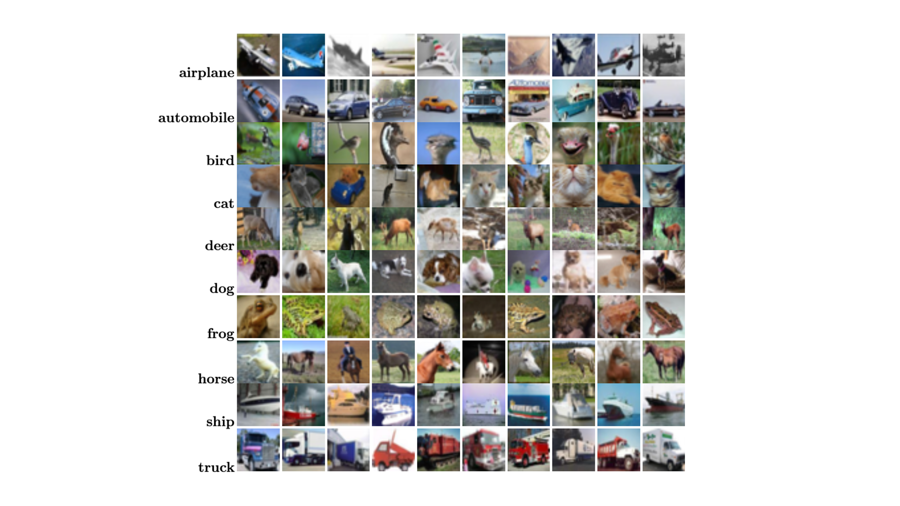
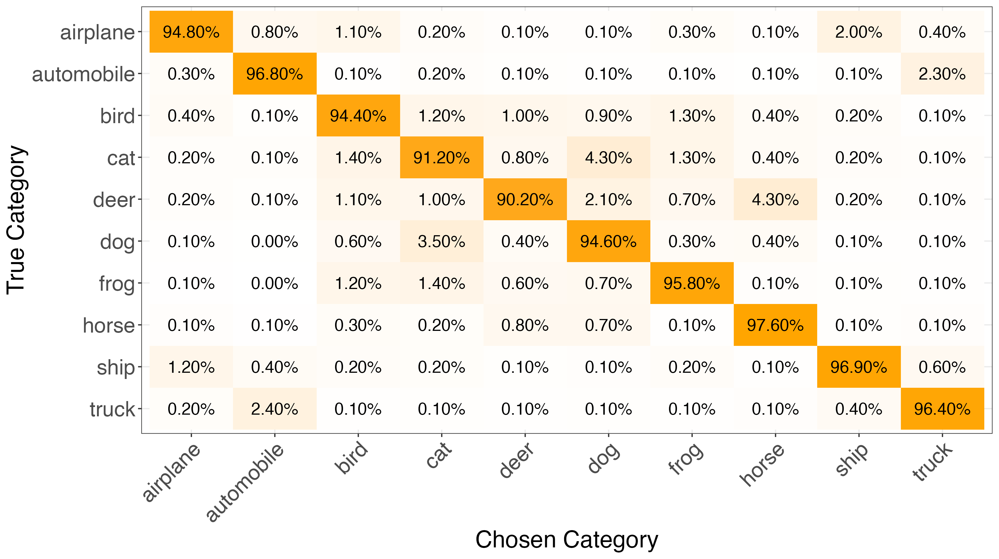
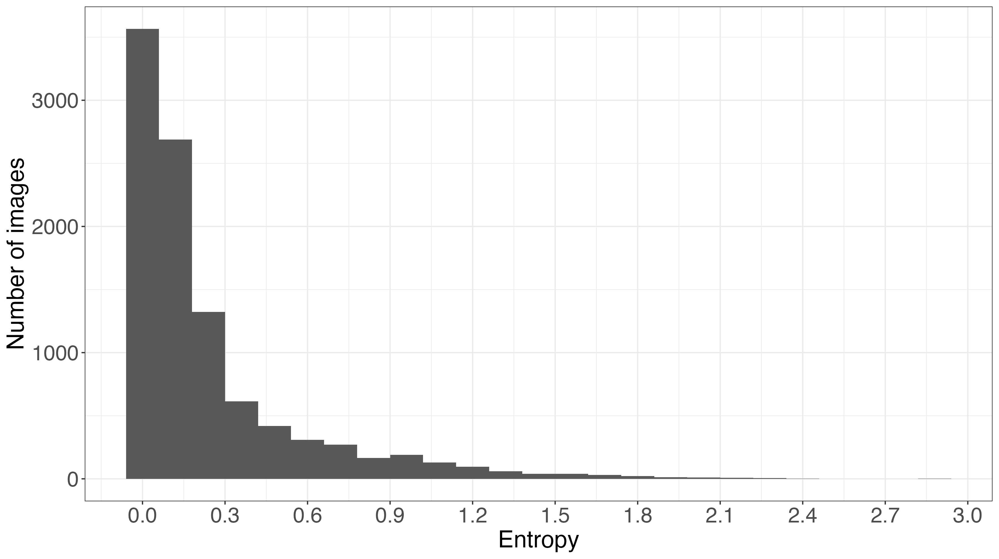
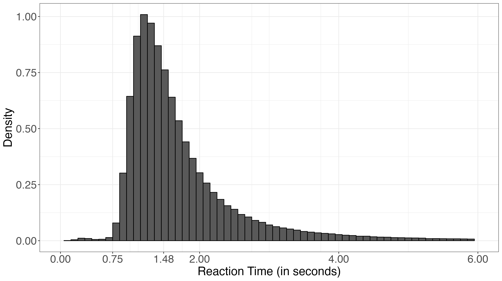
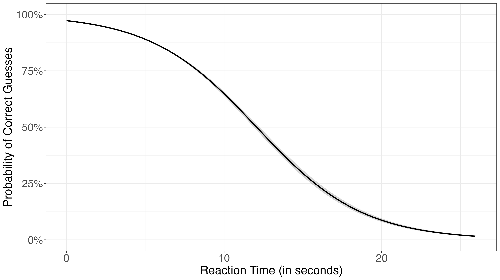
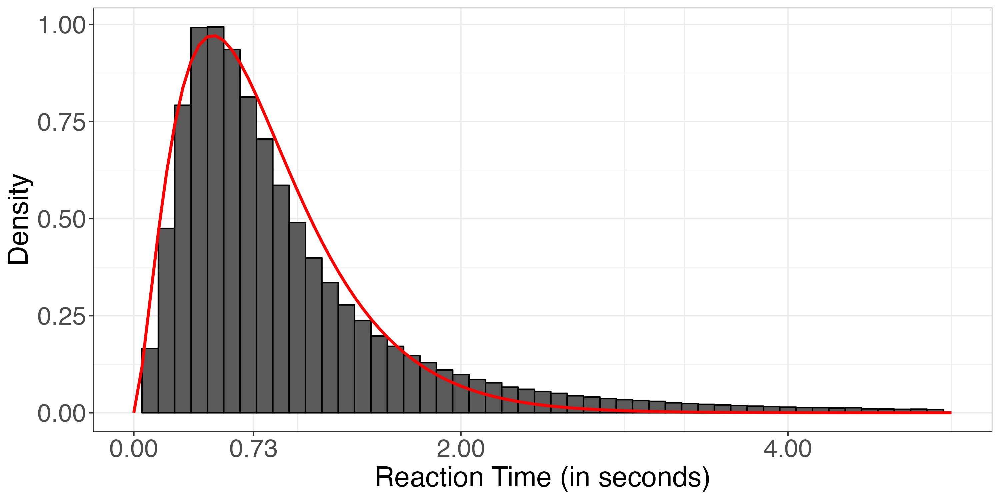
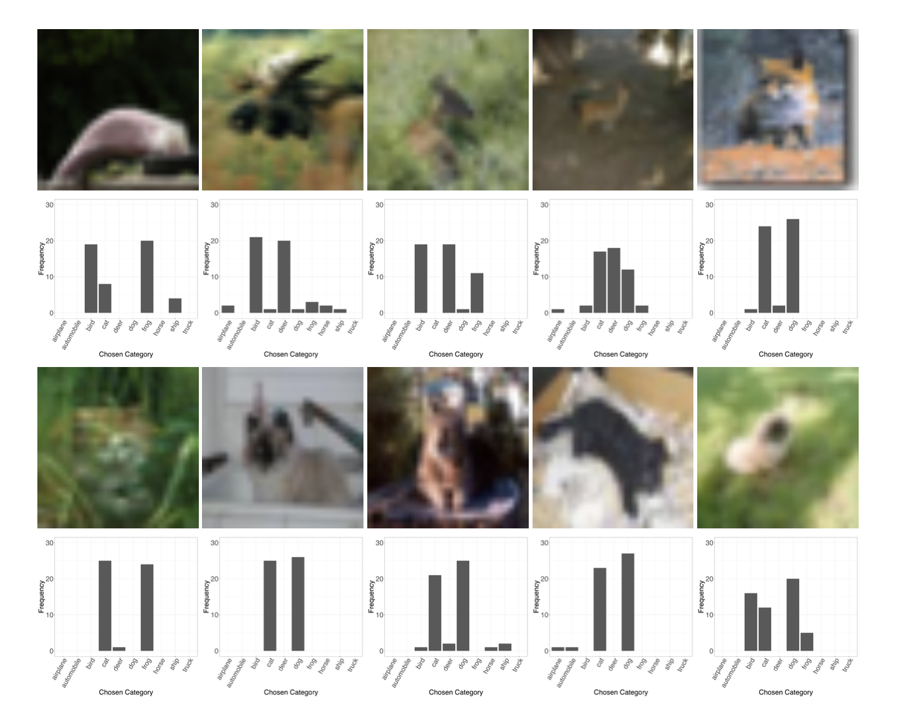
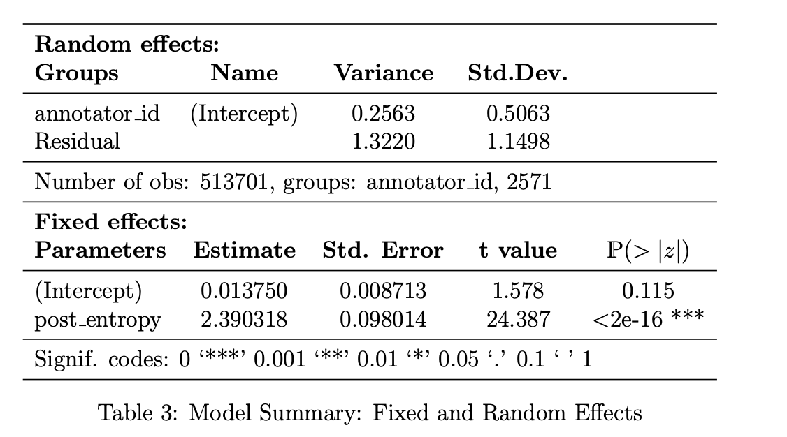

\input{../Thesis/shortcuts.tex}

##  {data-background-image="/Titelfolie/Slide4.png"}

## Introduction

## Introduction

**Context**

-   ML models that classify image data need labeled training data
-   Images belong to one specific class, that is unknown
-   The labelling process is imperfect and prone to errors and uncertainties that are usually **not** random

## Introduction

**Problem**

-   A lot of the information from the labelling process is disregarded
-   Unclear decision making process and unknown uncertainty of predictions
-   Finding patterns behind the errors and quantifying labelling uncertainty

## Introduction

**This Thesis**

-   Uses Bayesian Latent Class Mixture Model on the CIFAR10-H data set to solve the problems
-   Extends the analysis to quantify the effect of reaction time and the ambiguity of images

## Data

```{r}
library(tidyverse)
library(gt)
library(gamlss)
library(shiny)
library(latex2exp)

cifar10h <- read_csv("../data/cifar10h.csv")

cifar10h %>%
  sample_n(10) %>%
  arrange(as.numeric(annotator_id)) %>%
  select(image_filename, annotator_id, trial_index, true_category, chosen_category, correct_guess, subcategory, reaction_time, time_elapsed) %>%
  gt() %>% 
  tab_header(
    title = "CIFAR-10h Dataset",
    subtitle = "Random 10 rows of the CIFAR-10H dataset"
  ) %>%
  cols_label(
    image_filename = md("**image_filename**,<br>chr"),
    annotator_id = md("**annotator_id**,<br>chr"),
    trial_index = md("**trial_index**,<br>int"),
    true_category = md("**true_category**,<br>fac\\w10lvl"),
    chosen_category = md("**chosen_category**,<br>fac\\w10lvl"),
    correct_guess = md("**correct_guess**,<br>boolean"),
    subcategory = md("**subcategory**,<br>chr"),
    reaction_time = md("**reaction_time**,<br>dbl"),
    time_elapsed = md("**time_elapsed**,<br>dbl")
  )
```

## Data



## Data



## Data

{fig-align="center"}

$$
\begin{align*}
\scriptsize{H_{prior}^{(i)} = -\sum_{z = 1}^{10} p_z^{(i)} \log_2(p_z^{(i)})} \\
\end{align*}
$$

## Data




## Data



## Data



## Methodology

Bayesian Latent Class Mixture Model

$$
\scriptsize{
\begin{align}
    \mathbf{Z}^{(i)} &\sim \text{Multi}(\mathbf{\pi}, 1), i.i.d. \quad \text{with} \quad \mathbf{\pi} = (\pi_1, \ldots, \pi_K) \quad \text{and} \quad \sum_{k=1}^K \pi_k = 1, \\
    \mathbf{Y}^{(i)} | Z^{(i)} &\sim \text{Multi}(\mathbf{\theta}_{Z^{(i)}}, J^{(i)}) \quad \text{with} \quad \mathbf{\theta}_z = (\theta_{z1}, \ldots, \theta_{zK}) \quad \text{and} \quad \sum_{k=1}^K \theta_{zk} = 1.
\end{align}
}
$$

## Methodology

Stochastic Expectation-Maximization Algorithm

E-Step:

$$
\scriptsize{
\begin{align}
  {\hat{\tau}}_{z,t}^{(i)} = \mathbb{P}(Z_{t}^{(i)} = z|\mathbf{Y}^{(i)}; \hat{\mathbf{\pi}}_{t}, \hat{\Theta}_{t}) = \frac{\hat{\mathbf{\pi}}_{z,t} \mathbb{P}(\mathbf{Y}^{(i)};
        \hat{\mathbf{\theta}}_{z,t})}{\sum_{z' = 1}^K \hat{\mathbf{\pi}}_{z',t} \mathbb{P}(\mathbf{Y}^{(i)};
        \hat{\mathbf{\theta}}_{z',t})}.
\end{align}
}
$$

M-Step:

$$
\scriptsize{
\begin{align}
  {\hat{\mathbf{\pi}}}_{t+1} &= \frac{1}{n} \sum_{i=1}^n \mathbf{Z}_{t}^{(i)},\\
  \hat{\mathbf{\theta}}_{z,t+1} &= \frac{\sum_{i = 1}^n I(Z_t^{(i)} = z) Y_k^{(i)}}{\sum_{i = 1}^n I(Z_t^{(i)} = z) J^{(i)}}.
\end{align}
}
$$

## Image Ambiguity


## Image Ambiguity



## Reaction Time Differences


## Reaction Time Differences



## Discussion

1.  **Findings**: The Bayesian model effectively estimated labelling uncertainty for CIFAR-10H, showing good accuracy and revealing links between annotation time and uncertainty.

2.  **Applications/Limitations**: The method can improve model robustness but relies on assumptions that may not always hold.

3.  **Future Work**: Investigate how uncertainty affects model performance and apply the approach to other datasets and fields.
